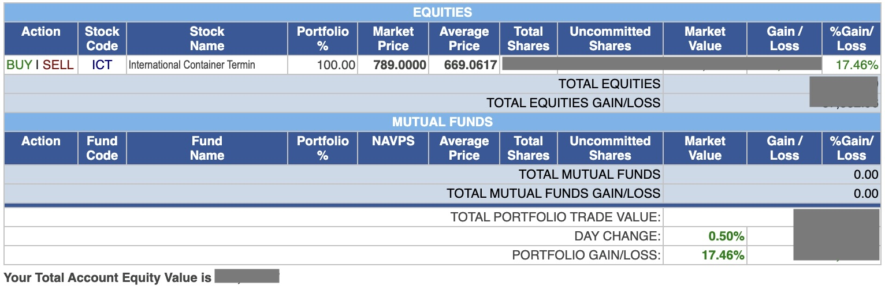
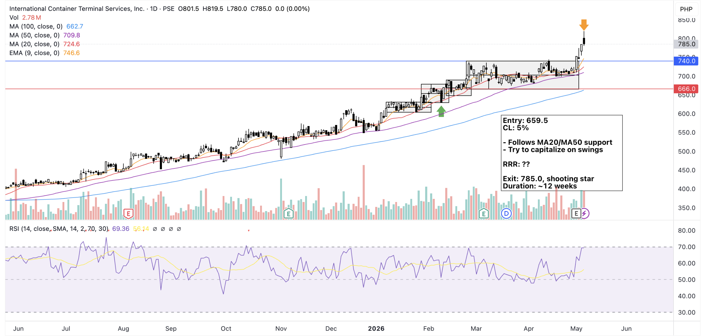

Fast forward from December of 2025 to today - I managed to increase the portfolio by about 25%.

*Snap of the port just before the sell execution. Actual exit value was at 785.*

Went all in with ICT considering the strong uptrend but didn't really have an entry price in mind.

The plan was to capitalize on the swings but my full-time job didn't allow me to check trends and execute trades in the middle of the day.

Fortunately, I'm on holiday today so I was able to monitor at EOD where I found a bearish candle for a sell signal.

How do you calculate the RRR when the stock is ATH levels?

Stock is still going strong. When do you re-enter?

