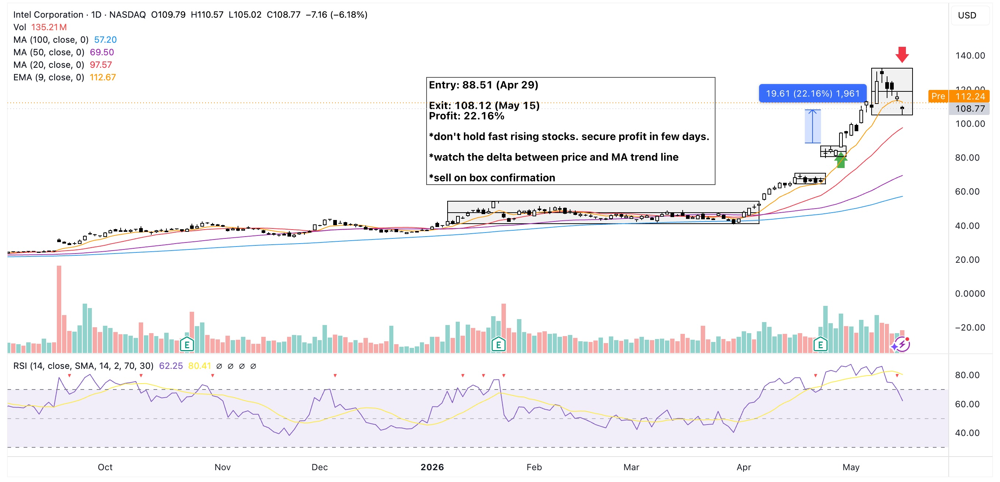

This is probably my first successful buy on gap trade. I saw the stock surging on the first half of the trading day (first hour if I remember correctly) and just bought without hesitation. But this was mainly because I wasn't treating my US account very seriously. It was an account I opened during the pandemic and put something there to see how much it will grow over time.

The actual upside could have been higher if only I had an exit plan. If I sold on box confirmation or validation, profit could have been 36%.

## Key takeaways
- {==Do NOT hold fast rising stocks for long==}
- {==Always monitor the delta between price and MA trend line.==}
- {==Consider to sell on box confirmation==}