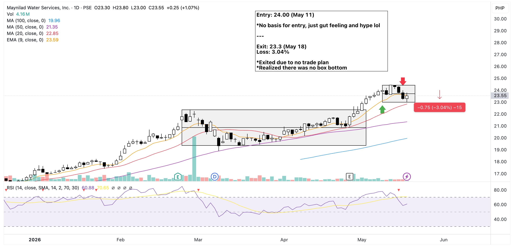

*Snap of the port just before the sell execution. Actual exit value was at 785.*

Honestly, I don't know what got into me buying this stock. Perhaps it was the hype seeing the price at a very low price but with the same growth potential as ICT. Add to that I just exited my ICT trade so I was eager of entering the market again. But where's the TA in that?

{==Don't rush to re-enter the market. Chill, bruh!==}