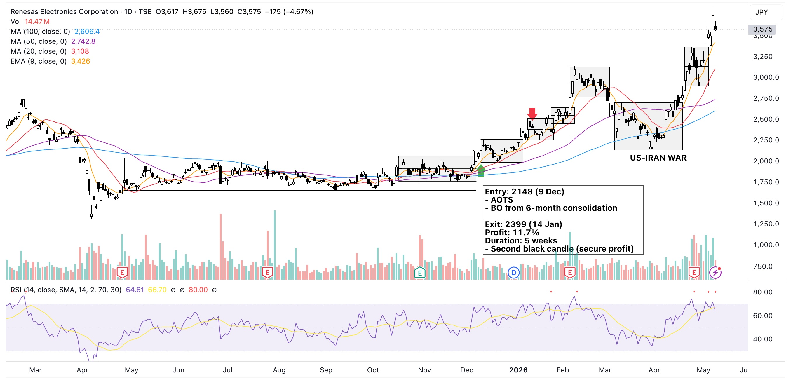

This needs to go the vault because this is the trade that, in fact, gave me the confidence to get back into trading. Honestly, I've never thought I would be trading in the Japan market for the main reason I couldn't understand Nihonggo. Well, I still can't understand very well until now, but here I am, playing in the market in humble beginnings.

This is technically my first TSE trade. The total holding period was about 5 weeks which I thought would have taken less time to make the same amont of profit. Saw this stock on the screener with a good amount of volume with a price breakout from a 6-month consolidation phase. Entered at the third candle.

Stock consolidated for a few weeks before breaking out once more. Exited at second candle of box formation.

## In retrospect
Yes, it indeed formed a new box but with higher lows. I could have planned another entry at box bottom.

If I followed through, the exit plan could have been the box breakdown. If that happened, I still would have profited another ~27%.

Bears took over at the start of March on fears of oil supply shortage due to the US attack on Iran. Even then, the stock recovered following EMA9.

