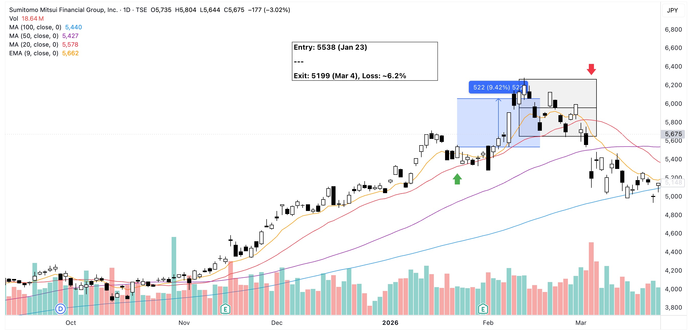

My entry here was on spot. The idea was for the price to bounce back from EMA9.

EMA9 was also close to MA20 so it could act as another support level. Delta between these two lines was about 3.7% so that's another 1.3% headroom from the latter.

13 candles later the price potential profit reached 13.3%. Realistically, I could have secured my profit on the next two lower candles but obviously that didn't happen. If it did, that could still have been a profit of 5.8%.

The takeaway: {==**Exit on box formation**==}